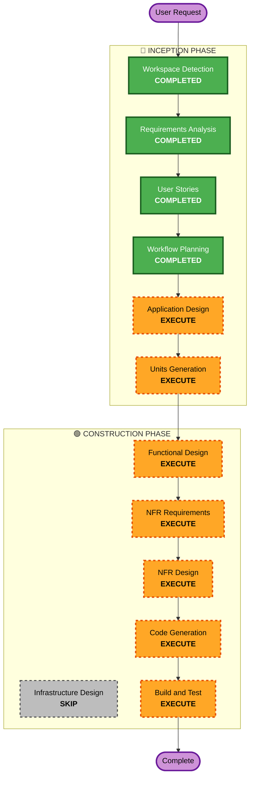

# Execution Plan

## Detailed Analysis Summary

### Change Impact Assessment
- **User-facing changes**: Yes - 고객용 주문 UI, 관리자용 대시보드 신규 구축
- **Structural changes**: Yes - 전체 시스템 신규 설계 (백엔드 + 프론트엔드 2개 + DB)
- **Data model changes**: Yes - 매장, 테이블, 메뉴, 주문, 세션 등 전체 스키마 신규
- **API changes**: Yes - REST API 전체 신규 설계
- **NFR impact**: Yes - SSE 실시간 통신, JWT 인증, 성능 요구사항

### Risk Assessment
- **Risk Level**: Medium (Greenfield이므로 기존 시스템 영향 없으나, 실시간 통신 등 기술적 복잡도 존재)
- **Testing Complexity**: Moderate (SSE, 세션 관리, 멀티 매장 테스트 필요)

## Workflow Visualization

## Phases to Execute

### 🔵 INCEPTION PHASE
- [x] Workspace Detection (COMPLETED)
- [x] Reverse Engineering (SKIPPED - Greenfield)
- [x] Requirements Analysis (COMPLETED)
- [x] User Stories (COMPLETED)
- [x] Workflow Planning (COMPLETED)
- [ ] Application Design - EXECUTE
  - **Rationale**: 신규 시스템으로 컴포넌트 구조, 서비스 레이어, API 설계 필요
- [ ] UI Design - EXECUTE
  - **Rationale**: 화면 목록, 네비게이션 플로우, 컴포넌트 트리 정의
- [ ] Units Generation - EXECUTE
  - **Rationale**: 4개 Domain Slice (인증/메뉴/주문/테이블관리)로 분해 필요

### 🟢 CONSTRUCTION PHASE (per-unit)
- [ ] Functional Design - EXECUTE
  - **Rationale**: 데이터 모델, 비즈니스 로직, API 엔드포인트 상세 설계 필요
- [ ] NFR Requirements - EXECUTE
  - **Rationale**: SSE 실시간 통신, JWT 인증, 성능 요구사항 구체화 필요
- [ ] NFR Design - EXECUTE
  - **Rationale**: NFR 패턴 (SSE 구현, 인증 미들웨어, 에러 핸들링) 설계 필요
- [ ] Infrastructure Design - SKIP
  - **Rationale**: MVP는 로컬 개발 환경, 별도 인프라 설계 불필요
- [ ] Code Generation - EXECUTE (ALWAYS)
  - **Rationale**: 전체 코드 구현 필요
- [ ] Build and Test - EXECUTE (ALWAYS)
  - **Rationale**: 빌드 및 테스트 검증 필요

### 🟡 OPERATIONS PHASE
- [ ] Operations - PLACEHOLDER

## Success Criteria
- **Primary Goal**: 테이블오더 MVP 서비스 구축 (고객 주문 + 관리자 모니터링)
- **Key Deliverables**: Go 백엔드, React 고객용/관리자용 프론트엔드, MySQL 스키마
- **Quality Gates**: 전체 FR/NFR 충족, SSE 2초 이내 주문 전달, 메뉴 조회 500ms 이내
